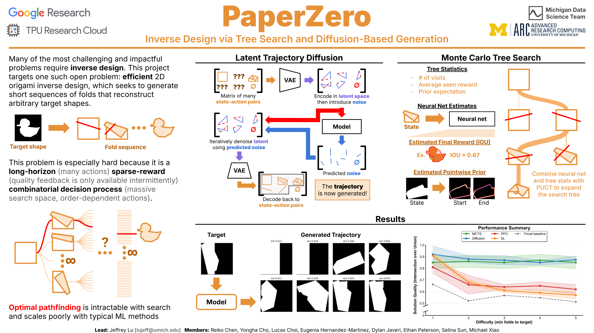

# PaperZero, Winter 2026

We built latent trajectory diffusion and MCTS models to evaluate their performance on the long-horizon sparse reward problem of efficient 2D origami inverse design.

We found that these methods have similar performance in this benchmark and are more robust than classical SL and RL approaches as the minimum successful trajectory length increases.

## Schedule and Resources

| **Week** | **Slides** | **Topics** | **Links** |
| --- | --- | --- | --- |
| 1 [1/25] | [Link](https://docs.google.com/presentation/d/1uXB1RtXhsvnTEM2MBxxwNUeEoNolN9FYiS45UkPKxjM/edit?usp=sharing) | Intro and setup | [Existence paper](https://dl.acm.org/doi/pdf/10.1145/304893.304933), [Origami is NP-Hard](https://arxiv.org/pdf/1008.1224) |
| 2 [2/1] | [Link](https://docs.google.com/presentation/d/1jD12DnJZxx7jQRWJ_R-Frz9TyVPNW3pZWe3-5gTS984/edit?usp=sharing) | Thinking | [Nice book](https://en.wikipedia.org/wiki/Thinking,_Fast_and_Slow), [AlphaGo paper](https://www.nature.com/articles/nature16961), [Trajectory diffusion paper](https://arxiv.org/pdf/2205.09991) |
| 3 [2/8] | [Link](https://docs.google.com/presentation/d/1MZe3lS8qiJf9P9qsbLNTqYp1HvTwXuCuv6mysn3bOkw/edit?usp=sharing) | Neural Nets | [Very nice VAE article](https://www.ibm.com/think/topics/variational-autoencoder), ["Inverse" Convolution](https://docs.pytorch.org/docs/stable/generated/torch.nn.ConvTranspose2d.html) |
| 4 [2/15] | [Link](https://docs.google.com/presentation/d/1rWmRIyFgGiBTL4KvoY9_gK5Zj4pU1hv97tHS-sfMXnM/edit?usp=sharing) | Heads, Trees, and VAEs | [VAE explainer](https://xnought.github.io/vae-explainer/) |
| 5 [2/22] | [Link](https://docs.google.com/presentation/d/1tcJ4m0nXVUpFHoAOz68hvhYdSc0xaxlkEB70pyQQgko/edit?usp=sharing) | Review, Trees, and Optimization | - |
| 6 [3/15] | [Link](https://docs.google.com/presentation/d/17iYOpoptnzN54yRbf1hMKZyJy2qWvAMbGDMZ3qouZ2k/edit?usp=sharing) | Updates, DDPM, Algorithms | [DDPM Tutorial](https://learnopencv.com/denoising-diffusion-probabilistic-models/) |
| 7 [3/22] | [Link](https://docs.google.com/presentation/d/12H-c2ph2XUCa9jWCh4nhdwdcb_5z7vVKbIrOjz33fa8/edit?usp=sharing) | Data and Models (Summary) | [OG U-Net Paper](https://arxiv.org/pdf/1505.04597) |
| 8 [3/29] | [Link](https://docs.google.com/presentation/d/17PhuDfpHRFUqHmauGOUBuHJX-GFP21CS7T6dTFI-PuM/edit?usp=sharing) | Models, Efficient Training | - |
| 9 [4/5] | [Link](https://docs.google.com/presentation/d/11OtW1bxVI4COa_UBSV_AvbwqbWQv8G5Oq3mCagMkyzI/edit?usp=sharing) | HPC and Training Review | [Slurm Guide](https://documentation.its.umich.edu/arc-hpc/slurm-user-guide) |
| 10 [4/12] | [Link](https://docs.google.com/presentation/d/1K4d66FZJ6VnB8YZtJ58-Za-zXQz0edr-hIuXr-Wqg04/edit?usp=sharing) | Logistics and Training Cont. | [Better late than never lecture on diffusion](https://www.youtube.com/watch?v=tr-CUpw--ck) |

## Contributions

**Lead:** Jeffrey Lu - `lujeff [at] umich [dot] edu`

**Members:** Reiko Chen, Yongha Cho, Lucas Choi, Eugenia Hernandez-Martinez, Dylan Javeri, Ethan Peterson, Selina Sun, Michael Xiao

Note that some contributors elected to work together using collaboration tools therefore don't appear on the contributor list for this repo.

**Code Contributions:** The C++ origami library in `/paper` was written entirely by Jeffrey. A large portion of the code in `/data`, `/docs`, `/diffusion/data`, and `/mcts/visualizer` was written by GPT 5.3 Codex with limited supervision due to time and bandwidth constraints. The remaining portions of this codebase were written collaboratively by members of this project.

## Acknowledgements

This project is supported by compute resources provided by [MIDAS](https://midas.umich.edu/), [U-M ARC High Performance Computing](https://its.umich.edu/advanced-research-computing), [Google Cloud](https://cloud.google.com/), and [Google TPU Research Cloud](https://sites.research.google/trc/about/)

This project was run through the [Michigan Data Science Team](https://mdst.club) in the Winter 2026 term.
